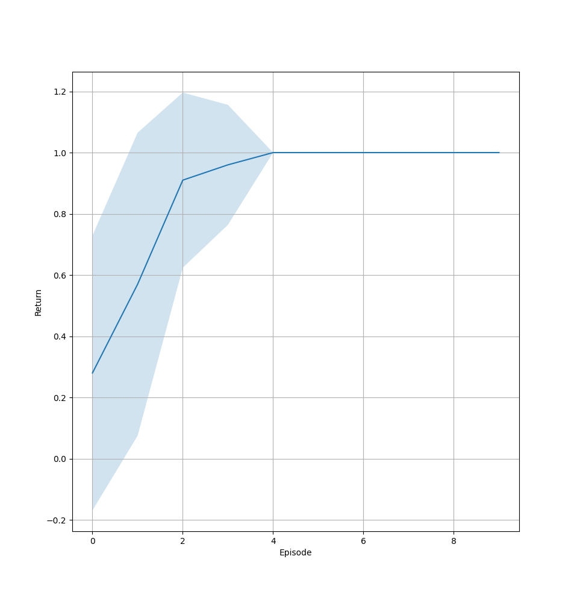
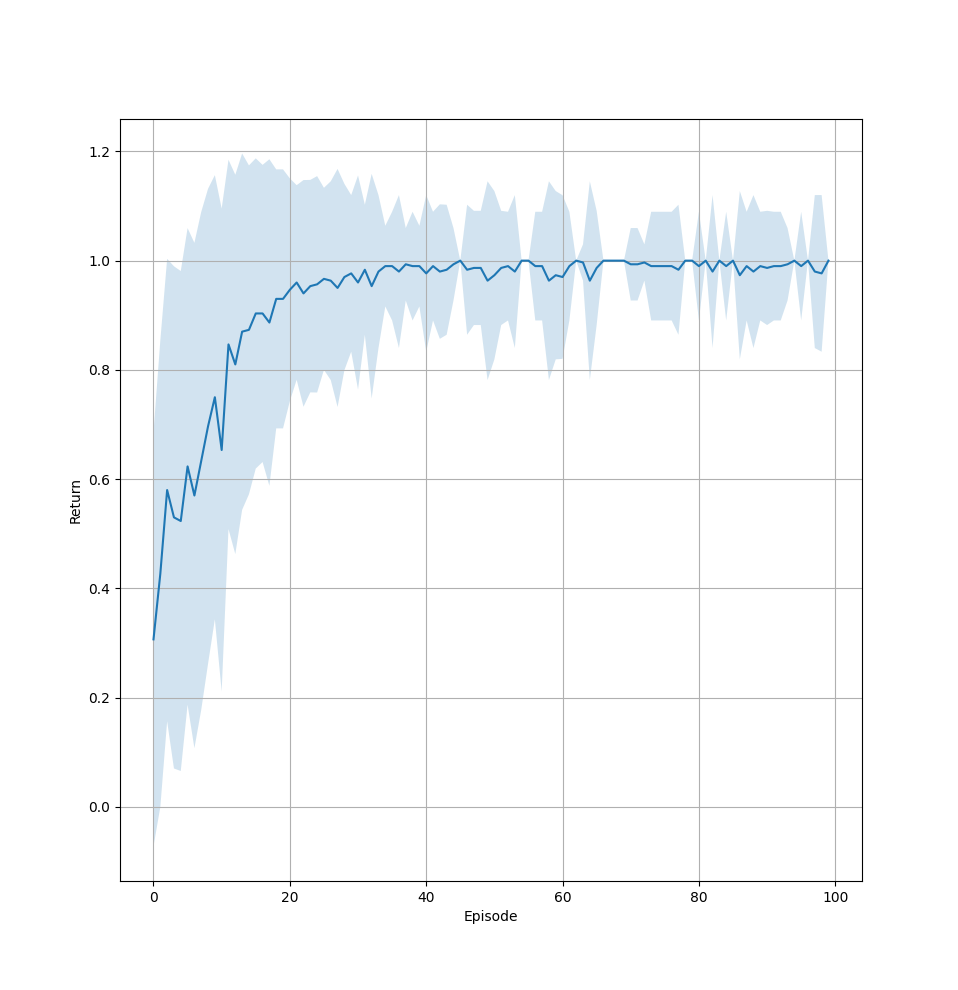
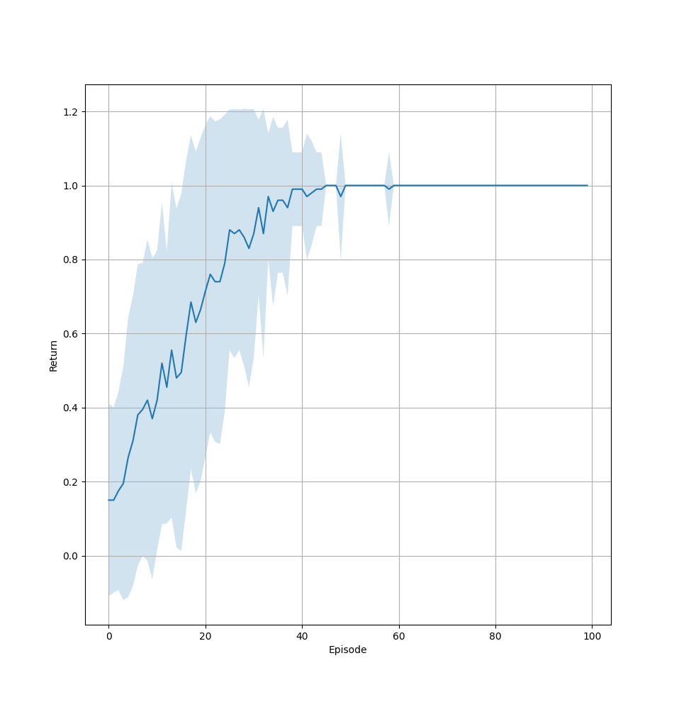
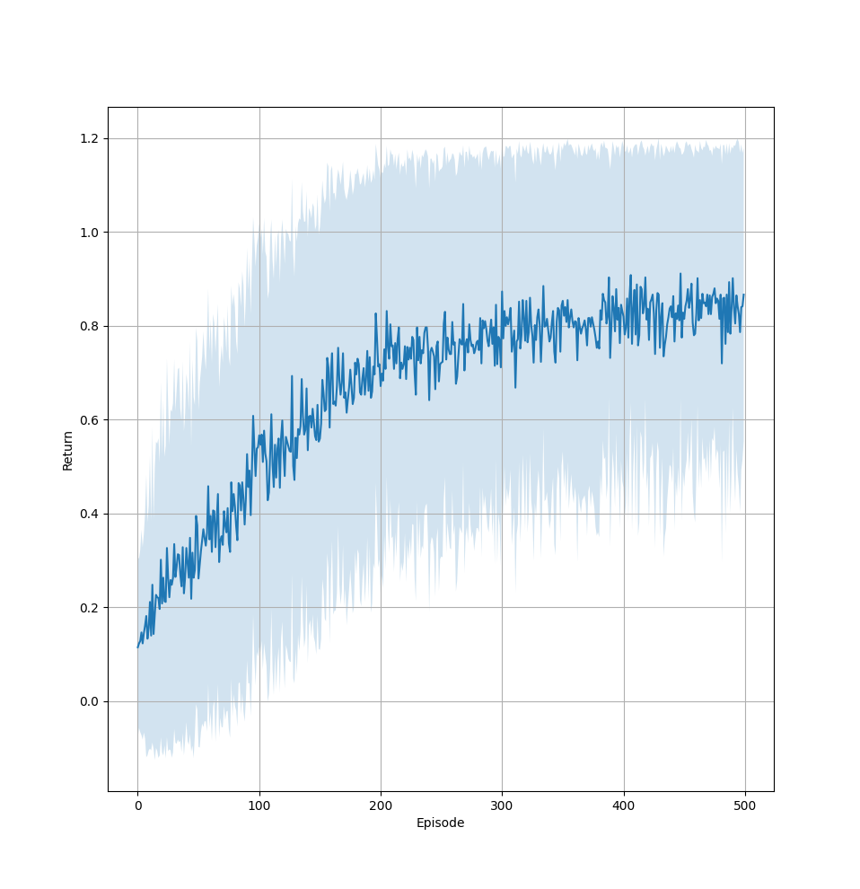
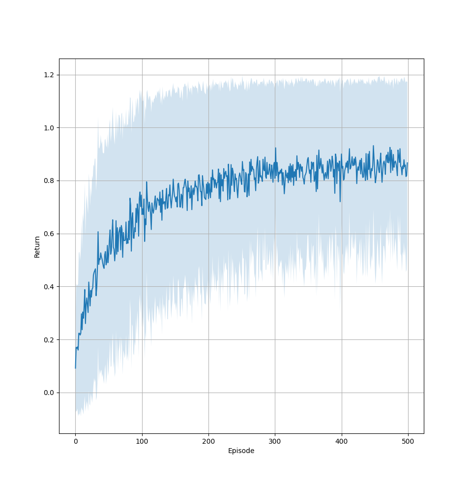
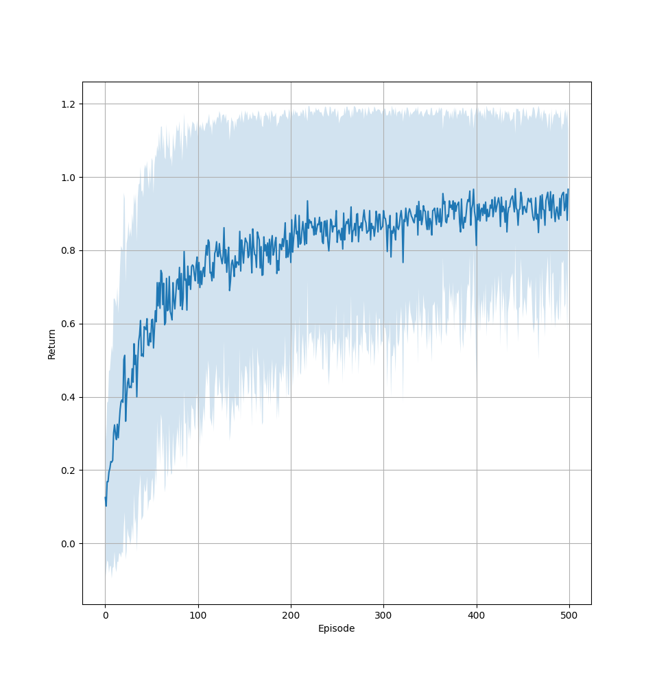

# [PPO](https://arxiv.org/abs/1707.06347) solution of the **[level-based foraging](https://github.com/semitable/lb-foraging)** environment

Solution to the [Multiagent systems](https://is.cuni.cz/studium/eng/predmety/index.php?do=predmet&kod=NAIL106) practicals MARL assignment.

A better documentation of a slightly modified version can be found in the [posggym](https://posggym.readthedocs.io/en/latest/environments/grid_world/level_based_foraging.html) library.

## Installation

Python 3.12.1 is recommended but similar versions should work too.

Install dependencies for the current python environment `pip install -r requirements.txt`.
You can force specific Pytorch build. For that you need to append `--extra-index-url=https://download.pytorch.org/whl/<build>` to the command above.
Example of builds:
* `cpu`: cpu only 
* `cu118`: CUDA 11.8
* `rocm5.7`: AMD ROCm 5.7

More information and available builds can be found [here](https://pytorch.org/get-started/locally/). Note that Pytorch website suggests `--index-url` instead. This will fail to install other non-pytorch packages from the `requirements.txt` list.

***TL;DR*** minimal installation: `pip install -r requirements.txt --extra-index-url=https://download.pytorch.org/whl/cpu`.

## Evaluation

To run the evaluation run  the main python file with the `--evaluate` flag.
You must specify the path to the saved checkpoint via `--model` and set all appropriate flags such as network shape, env size etc.
The repository contains some pretrained models in the `checkpoints/` directory.
All of them follow a naming convention.

* `eX`: `--env_size X`
* `pX`: `--players X`
* `fX`: `--foods X`
* `hX`: `--hidden_size X`
* `oh`: `--one_hot`
* `cX`: `--critic_layers X` (this is not needed for the evaluation since only the actor is saved/loaded)

All other flags and further description can be found by running `python main.py --help`.

## Training

Whenever the `--evaluate` flag is ***not*** set a training of a new model will start.
The `--live_plot` will save the figure at the end of training to a png file based on the model path.
See `python main.py --help` for more info.

## Results

||||
|:-:|:-:|:-:|
|  |  | |
|e4p1f1h16oh|e5p2f2h64oh|e5p1f3h64oh|
|  |  |  |
|e8p3f3h128|e8p3f3h128oh|e8p3f3h256c2oh|

